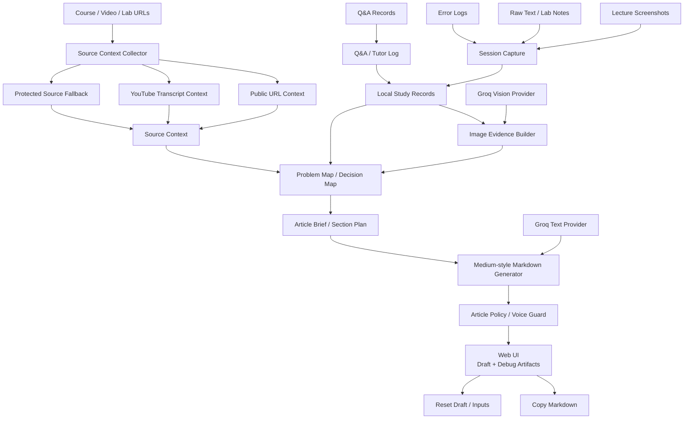
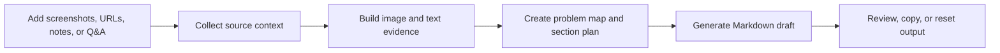

# AI Study Documentation Agent

**언어:** [English](./README.md) | 한국어

AI Study Documentation Agent는 흩어진 학습 기록을 구조화된 기술 글로 변환하는 학습 문서화 파이프라인입니다.

강의, 코딩 실습, 디버깅 과정에서는 스크린샷, URL, 메모, 에러 로그, Q&A가 서로 흩어지기 쉽습니다. 이 프로젝트는 그 기록을 세션 기반 evidence로 묶고, 문제 해결형 기술 노트와 블로그 초안으로 재구성합니다.

---

## Demo

- Live Demo: https://huggingface.co/spaces/onekindalpha/ai-study-documentation-agent

## Overview

이 프로젝트는 학습 과정의 판단 흐름을 보존하기 위해 만들었습니다.

스크린샷, 메모, 에러, 질문을 각각 따로 저장하는 대신 하나의 학습 세션으로 묶고, 이후 기술 문서로 재사용할 수 있도록 정리합니다.

목표는 단순 노트 저장이 아니라, 실제 학습 흔적을 다시 읽을 수 있는 기술 문서로 변환하는 것입니다.

---

## What It Does

이 프로젝트는 기술 학습 기록을 캡처에서 글쓰기까지 연결하는 workflow입니다.

사용자는 다음 작업을 할 수 있습니다.

- 스크린샷, 강의 URL, 메모, 에러 로그, Q&A 기록 수집
- 학습 기록을 capture 또는 session 단위로 정리
- public URL과 YouTube transcript 기반 source context 수집
- vision-capable LLM provider를 활용한 screenshot evidence 해석
- 학습 중 Q&A history 보존
- 문제 인식, 원인 분석, 조치, 검증, 결과 중심의 Medium-style 기술 글 초안 생성
- 생성 결과를 Markdown으로 복사

이 서비스는 학습자의 판단을 대체하지 않습니다. 학습과 디버깅 과정에서 생긴 reasoning path를 보존하고, 나중에 기술 문서로 재구성할 수 있게 돕는 것이 목적입니다.

---

## Key Features

- Screenshot 기반 learning evidence reconstruction
- URL-assisted source context collection
- YouTube transcript 기반 source enrichment
- Session-based capture timeline
- Q&A log와 tutor-style answer record
- Vision/fallback handling을 포함한 image evidence builder
- Problem map과 decision map generation
- Article brief와 section plan generation
- Medium-style Markdown draft generation
- Final draft validation을 위한 article policy / voice guard
- Evidence, section plan, generation result 확인용 debug artifacts
- Markdown copy 및 draft reset 지원

---

## Architecture

---

## System Flow

---

## Implementation Notes

- **Capture-first workflow**: screenshot, raw text, memo, source URL, Q&A를 개별 입력이 아니라 learning evidence로 처리합니다.
- **Session timeline**: 여러 capture와 Q&A log를 하나의 학습 세션으로 묶어 draft generation에 활용합니다.
- **Source collection**: public URL text와 YouTube transcript context를 수집합니다. protected source는 제공된 screenshot, note, manual context로 fallback합니다.
- **Vision-assisted evidence extraction**: screenshot을 visual learning evidence로 해석하고 caption, visible evidence, role, problem signal, technical entity로 정리합니다.
- **Problem reconstruction**: evidence를 problem map, decision map, article brief, section plan으로 재구성한 뒤 최종 article을 생성합니다.
- **Grounded draft generation**: captured evidence, source context, Q&A log, user note를 입력으로 사용합니다.
- **Final draft guard**: stale-topic contamination, weak evidence coverage, generic title, unsupported claim, incomplete problem-solution structure를 점검합니다.
- **Fallback behavior**: source collection 또는 LLM generation이 불가능할 때 unsupported detail을 만들지 않고 안전한 fallback note를 반환합니다.

---

## Tech Stack

- Backend: Python standard library HTTP server
- Frontend: HTML, CSS, JavaScript single-page UI
- LLM: Groq text generation and Groq vision model
- Source collection: public URL text extraction and YouTube transcript collection
- Storage: local study records and capture files
- Output: Markdown draft generation

---

## Project Status

이 프로젝트는 실제 학습 evidence를 재사용 가능한 기술 문서로 변환하는 portfolio-stage prototype입니다.

현재 구현은 session capture, evidence reconstruction, draft generation 흐름을 중심으로 구성되어 있습니다.

향후 backend modularization, browser-based capture flow, export option, test coverage, public demo stability를 개선할 예정입니다.

---

## Development Notes

로컬 실행, 환경변수, API route, runtime data path, deployment note는 [DEVELOPMENT.md](./DEVELOPMENT.md)에 분리했습니다.

---

## Portfolio Context

이 레포는 AI service / documentation workflow portfolio project로 포지셔닝합니다.

보여주는 역량은 다음과 같습니다.

- session-based capture workflow 설계
- 학습 자료 기반 source context 수집
- screenshot과 note를 structured learning evidence로 변환
- fragmented study record에서 problem-solving technical writing 생성
- incomplete, protected, weak source에 대한 안전한 fallback 처리
- capture, generation, debugging, copy, reset을 위한 browser-based UI 제공

---

## Honest Scope

이 프로젝트는 study capture와 technical draft generation을 지원합니다.

하지 않는 것:

- protected course page 자동 접근
- 불완전한 source에서 정답 보장
- 게시 전 manual technical review 대체
- general-purpose autonomous browser agent
