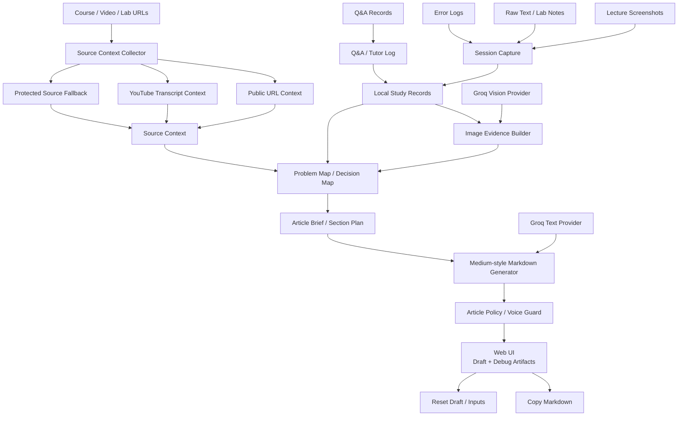
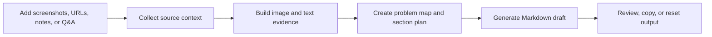

# Study Documentation Automation Ai Agent

**Language:** English | [한국어](./README.ko.md)

AI Study Documentation Agent is a study documentation pipeline that turns scattered learning records into structured technical writing.

During lectures, coding labs, and debugging sessions, useful learning evidence is often fragmented across screenshots, URLs, rough notes, error logs, and Q&A. This project organizes those records into session-based evidence and converts them into reusable technical notes, troubleshooting records, and problem-solving blog drafts.

The project focuses on the flow from **study evidence** to **context reconstruction** to **technical writing output**.

---

## Demo

- Live Demo: https://onekindalpha-study-documentation-ai-agent.hf.space/

## Overview

This project is designed for learners and developers who want to preserve the reasoning process behind their study and practice.

Instead of treating screenshots, notes, errors, and questions as separate fragments, the system groups them into a connected learning session. That session can then be used to generate structured technical documentation.

The goal is not simple note storage.  
The goal is to turn real learning traces into reusable documentation.

---

## What It Does

This project works as a capture-to-writing workflow for technical learning records.

It helps users:

- collect screenshots, course URLs, notes, error logs, and Q&A records
- organize learning evidence by capture or session
- collect source context from public URLs and YouTube transcripts
- interpret screenshot evidence with a vision-capable LLM provider
- preserve Q&A history from the learning process
- generate Medium-style technical blog drafts focused on problem recognition, cause analysis, action, validation, and outcome
- copy the generated output as Markdown

The goal is not to replace the learner's judgment. The goal is to preserve the reasoning path behind learning and debugging so it can be reconstructed later as technical documentation.

---

## Key Features

- Screenshot-based learning evidence reconstruction
- URL-assisted source context collection
- YouTube transcript-based source enrichment
- Session-based capture timeline
- Q&A log and tutor-style answer record
- Image evidence builder with vision/fallback handling
- Problem map and decision map generation
- Article brief and section plan generation
- Medium-style Markdown draft generation
- Article policy and voice guard for final draft validation
- Debug artifacts for reviewing evidence, section plans, and generation results
- Markdown copy and draft reset support

---

## Architecture

---

## System Flow

---

## Implementation Notes

- **Capture-first workflow**: screenshots, raw text, memo fields, source URLs, and Q&A records are treated as learning evidence rather than isolated inputs.
- **Session timeline**: the service can group multiple captures and Q&A logs into a single learning session before generating a draft.
- **Source collection**: public URL text and YouTube transcript context are collected when available. Protected or login-gated sources fall back to user-provided screenshots, notes, and manual context.
- **Vision-assisted evidence extraction**: screenshots are interpreted as visual learning evidence and mapped into captions, visible evidence, roles, problem signals, and technical entities.
- **Problem reconstruction**: evidence is organized into a problem map, decision map, article brief, and section plan before final article generation.
- **Grounded draft generation**: the generated article uses captured evidence, collected source context, Q&A logs, and user notes as inputs.
- **Final draft guard**: the output is checked for stale-topic contamination, weak evidence coverage, generic titles, unsupported claims, and incomplete problem-solution structure.
- **Fallback behavior**: when source collection or LLM generation is unavailable, the service returns a safer fallback note instead of fabricating unsupported details.

---

## Tech Stack

- Backend: Python standard library HTTP server
- Frontend: HTML, CSS, JavaScript single-page UI
- LLM: Groq text generation and Groq vision model
- Source collection: public URL text extraction and YouTube transcript collection
- Storage: local study records and capture files
- Output: Markdown draft generation

---

## Project Status

This project is a portfolio-stage prototype focused on converting real study evidence into reusable technical documentation.

The current implementation covers the core workflow from session capture to evidence reconstruction and draft generation.

The project is still being improved, especially around backend modularization, browser-based capture flow, export options, test coverage, and public demo stability.

---

## Roadmap

Planned improvements include:

- separating the backend into smaller modules
- improving browser-based capture flow
- adding stronger export options for Markdown and Notion
- improving source collection reliability
- adding tests for evidence processing and draft generation
- stabilizing public demo resources

---

## Development Notes

Local setup, environment variables, API routes, runtime data paths, and deployment notes are separated into [DEVELOPMENT.md](./DEVELOPMENT.md).

---

## Portfolio Context

This repository is positioned as an AI service / documentation workflow portfolio project.

It shows:

- designing a session-based capture workflow
- collecting source context from learning materials
- turning screenshots and notes into structured learning evidence
- generating problem-solving technical writing from fragmented study records
- handling incomplete, protected, or weak learning sources safely
- exposing a browser-based UI for capture, generation, debugging, copy, and reset workflows

The project is connected with other AI/backend portfolio work:

- Battery RUL AI Inference System: model inference, dashboard, and deployment
- Battery Technical Document RAG Assistant: technical document retrieval and grounded answer generation
- AWS 3-Tier Runbook AI Agent: infrastructure documentation search and troubleshooting support

---

## Honest Scope

This project does:

- organize study captures and Q&A records
- collect public source context when available
- interpret screenshots as learning evidence
- generate Markdown-based study notes and technical article drafts
- support portfolio-style problem-solving documentation

It does not:

- automatically access protected course pages without provided context
- guarantee correctness when source material is incomplete
- replace manual technical review before publishing
- operate as a general-purpose autonomous browser agent
