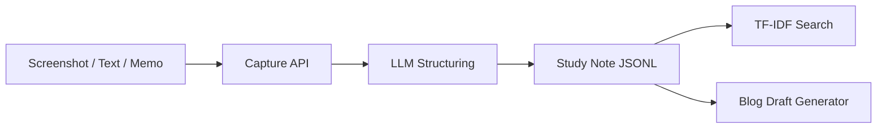

# AI Study Documentation Agent

학습 화면, 코드 실습, 에러 로그를 캡처 기록으로 저장하고 기술 노트와 블로그 초안으로 연결하는 개인 학습 기록 자동화 MVP입니다.

## Why

강의나 개발 실습 중에는 흐름을 끊고 필기하기 어렵습니다. 나중에 정리하려고 하면 어떤 화면에서 어떤 에러가 났는지, 어떤 개념을 왜 확인했는지, 어떤 해결을 시도했는지 흐려집니다.

이 프로젝트는 학습 중 발생하는 화면, 원문 텍스트, 개인 메모를 하나의 기록으로 묶고, AI가 다음 산출물로 정리하도록 설계했습니다.

- 학습 노트
- 에러 해결 기록
- 검색 가능한 개인 지식 DB
- 기술블로그 초안
- 포트폴리오 작성용 학습 과정 요약

## MVP Flow



## Features

- 이미지/스크린샷 업로드
- 화면 텍스트, 코드, 에러 로그, 개인 메모 입력
- LLM 기반 학습 노트 생성
- 최근 학습 기록 검색
- 최근 노트를 묶은 기술블로그 초안 생성
- 문제 해결형 Medium 포트폴리오 글 생성
- LLM API가 없을 때도 fallback note 생성

## Conversation Starter

```text
문제 해결형 Medium 글로 변환해줘.
```

이 버튼은 캡처 기록을 단순 요약하지 않고, 다음 흐름으로 재구성합니다.

```text
문제 인식 -> 문제 정의 -> 왜 문제로 인식했는가 -> 해결 과정 -> 복잡한 문제 해결 -> 성과 -> 코드/수식 -> Portfolio Summary
```

## Tech Stack

- Python standard library HTTP server
- Groq LLM API
- lightweight local keyword search
- JSONL local storage
- HTML/CSS/JavaScript single-page UI

## Run Locally

```bash
cd study-capture-agent
python -m venv .venv
source .venv/bin/activate
pip install -r requirements.txt
cp .env.example .env
python -m app.main
```

Open:

```text
http://127.0.0.1:7870
```

## Environment

```text
GROQ_API_KEY=your_api_key
GROQ_MODEL=llama-3.1-8b-instant
GROQ_VISION_MODEL=meta-llama/llama-4-scout-17b-16e-instruct
GROQ_VISION_CHUNK_SIZE=3
GROQ_VISION_MAX_TOKENS=1200
PORT=7870
```

## Hugging Face Spaces

Docker Space에서는 `PORT=7860`으로 실행됩니다. `GROQ_API_KEY`는 Space Settings의 Secret으로 등록하고 저장소에 커밋하지 않습니다. 자세한 순서는 `HUGGINGFACE_DEPLOY.md`를 확인하세요.

## Next Steps

- OCR/Vision API로 이미지 내 텍스트 자동 추출
- 단축키 기반 화면 캡처
- Notion API export
- 중복 노트 병합
- 에러 해결 과정 자동 분류
- Agent workflow: capture reviewer, note organizer, blog publisher
